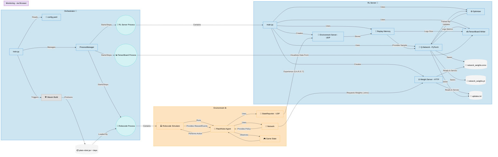
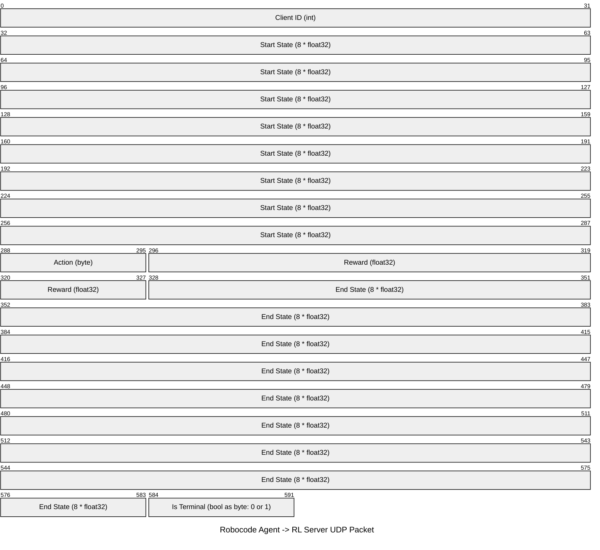

# Slajd 1

## Plato: Inteligentne Roboty Robocode

**Wyzwanie:** Jak nauczyć robota Robocode skutecznej strategii walki bez ręcznego programowania złożonych reguł?

**Koncepcja:** Zastosowanie **Uczenia ze Wzmocnieniem (Reinforcement Learning)** w architekturze rozproszonej.

* Robot (Agent) uczy się metodą prób i błędów w symulatorze Robocode.
* Centralny Serwer RL analizuje doświadczenia i trenuje "mózg" robota.
* Orkiestrator zarządza całym procesem treningu.

---

# Slajd 2

## Architektura Systemu Plato

Szczegółowy diagram przedstawiający komponenty i przepływ danych.

---

# Slajd 3

## Opis Architektury

* **Orchestrator (Python):** Kontroluje całość. `train.py` czyta `config.yaml` i używa `ProcessManager` do zarządzania procesami: Robocode (`RP`), Serwera RL (`SP`) i TensorBoard (`TBP`). Inicjuje też budowanie (`Maven Build`).
* **RL Server (Python):** Uruchomiony jako proces (`SP`). `main.py` tworzy serwer UDP (`ES`) do odbierania doświadczeń i serwer HTTP (`WS`) do udostępniania wag `.onnx`. Używa `PyTorch` do trenowania sieci Q (`QNet`) na danych z Pamięci Powtórek (`Mem`), aktualizując wagi za pomocą `Optimizera`. Zapisuje metryki (`TBW`) i modele (`.onnx`, `.pt`, `updates.txt`).
* **Environment (Java/Robocode):** Proces Robocode (`RP`) uruchamia agenta (`PlatoRobot Agent`). Agent używa sieci neuronowej (`NetDJL` - ładowanej z `.onnx`) do podejmowania decyzji na podstawie stanu gry (`GameState`). Wysyła doświadczenia (S,A,R,S',T) przez `StateReporter (UDP)` do serwera (`ES`). Pobiera aktualne wagi (`.onnx`) z serwera (`WS`).
* **Monitoring:** Proces TensorBoard (`TBP`) wizualizuje metryki zapisane przez serwer RL (`TBW`).

---

# Slajd 4

## Jak Robot Się Uczy? (Cykl Treningowy)

1. **Działanie:** Robot w Robocode obserwuje `GameState` i używa swojej lokalnej sieci `NetDJL` (wagi z `.onnx`) do wyboru akcji.
2. **Doświadczenie:** Wykonuje akcję w `Simulatorze`, obserwuje nowy `GameState` i otrzymuje nagrodę.
3. **Przesłanie Danych:** `StateReporter` wysyła pakiet UDP z krotką doświadczenia (S,A,R,S',T) do `Environment Server (ES)` na Serwerze RL.
4. **Nauka na Serwerze:** `ES` zapisuje dane w `Replay Memory (Mem)`. Gdy jest wystarczająco danych, `QNet` jest trenowana na próbce z `Mem` przez `Optimizera`.
5. **Aktualizacja Wiedzy Robota:** `QNet` jest okresowo zapisywana do pliku `.onnx`. `Weight Server (WS)` udostępnia ten plik. Agent (`NetDJL`) pobiera go przez HTTP i aktualizuje swoją lokalną sieć.

**Powtarzanie tego cyklu sprawia, że `QNet` (i tym samym `NetDJL`) staje się coraz lepsza w podejmowaniu decyzji.**

---

# Slajd 5

## Format Danych: Pakiet UDP Agent -> Serwer

Struktura pakietu wysyłanego z `StateReporter` (Agent) do `Environment Server` (Serwer RL).

---

# Slajd 6

## Opis Pakietu UDP

Pakiet zawiera komplet informacji o jednym kroku (przejściu) wykonanym przez agenta.

* **Client ID (bity 0-31):** Unikalny identyfikator robota (int, 4 bajty).
* **Start State (bity 32-287):** Stan gry przed akcją (8 * float32 = 32 bajty).
* **Action (bity 288-295):** Wykonana akcja (byte, 1 bajt).
* **Reward (bity 296-327):** Otrzymana nagroda (float32, 4 bajty).
* **End State (bity 328-583):** Stan gry po akcji (8 * float32 = 32 bajty).
* **Is Terminal (bity 584-591):** Czy stan końcowy? (byte, 1 bajt: 0=Nie, 1=Tak).

Łącznie 74 bajty danych o przejściu w każdym pakiecie UDP.
